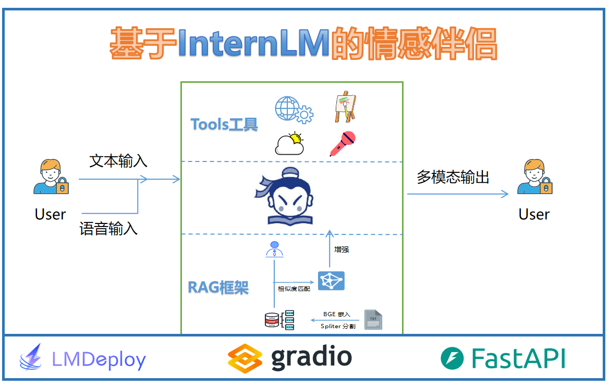

# AI Emotional Companion Project

## Project Overview

This project aims to develop an AI-based emotional companion that leverages the power of large language models and advanced speech technology. The core value proposition of this AI companion is its ability to deeply personalize interactions and emotionally resonate with users in their daily lives. This project uses InternLM2 as the language model and ChatTTS for speech input and output, ensuring a seamless and immersive user experience.

## Vision and Core Values

- **Vision**: To create an AI companion that goes beyond a mere tool and becomes a trusted confidant, deeply understanding and supporting users through personalized and emotionally resonant interactions.
- **Core Values**:
  - **Personalized Experience**: The AI companion tailors its interactions based on the user’s daily behaviors, emotional states, and interests.
  - **Emotional Resonance**: By utilizing advanced emotion recognition and response mechanisms, the AI establishes a deep emotional connection with users.
  - **Continuous Companionship**: The AI companion is seamlessly integrated into the user's life, providing timely and empathetic support across various scenarios.

## User Experience Design

- **Personalized Emotional Guidance**:
  - The AI companion not only responds to users but also actively guides them in exploring and expressing their emotions. This includes periodic "emotional check-ins" that help users reflect and manage their moods.
  - The AI can act as an "emotional coach," offering advice on emotional management and mental well-being when needed.
  
- **Multimodal Interaction**:
  - The AI companion interacts with users through a variety of modalities, including voice, text, images, and videos. For example, it can engage in "face-to-face" conversations via video calls, providing a more intimate interaction.
  - Supports hybrid voice and text dialogues, allowing users to switch freely between modes depending on the context.
  
- **Immersive Experience**:
  - By integrating virtual reality (VR) or augmented reality (AR), the AI companion provides a more immersive companionship experience. For instance, the AI companion can appear as a virtual figure to keep the user company.
  - The AI can control smart home devices (e.g., lights, music) to create a suitable ambiance for relaxation or focus.

## Technical Architecture

The technical architecture of the AI Emotional Companion Project is designed to provide a robust, scalable, and user-centric experience:

1. **User Interaction Layer**: Manages user interactions, including voice and text input/output.
2. **Voice Input & Output**: Handles voice input through ChatTTS and generates voice output.
3. **Text Input & Output**: Processes and manages text-based input and output.
4. **Emotion Recognition Engine**: Extracts emotional information from both voice and text to guide response generation.
5. **Contextual Understanding Module**: Ensures dialogue coherence by understanding the context of conversations.
6. **InternLM2 Core Engine**: The central large language model responsible for generating responses.
7. **ChatTTS Module**: Manages speech synthesis and converts speech input.
8. **Data Storage & User Profile Management**: Stores user data and manages user profiles to enable personalization.

## Innovation in Technology

- **Personalized Model Training**:
  - Utilizing InternLM2 and ChatTTS, the models are dynamically fine-tuned based on user interactions to progressively meet individual needs.
  - Reinforcement learning is employed to continuously optimize the AI's emotional response and behavior strategies based on user feedback.
  
- **Multimodal Emotion Engine**:
  - Develop a multimodal emotion engine that synthesizes input from voice, text, expressions, and behaviors to generate more accurate emotional feedback.
  - By combining emotion analysis with deep learning models, the AI can comprehend complex emotional states and subtle changes, leading to more nuanced emotional resonance.
  
- **Seamless Multi-Device Integration**:
  - A cross-platform synchronization mechanism ensures that the AI companion can switch seamlessly between devices like smartphones, computers, and smart speakers while maintaining a consistent interaction experience.
  - Edge computing technology is used to process some data locally, reducing cloud latency and enhancing privacy.

## Technical Architecture

The technical architecture of the AI Emotional Companion Project is designed to provide a robust, scalable, and user-centric experience:

1. **User Interaction Layer**: Manages user interactions, including voice and text input/output.
2. **Voice Input & Output**: Handles voice input through ChatTTS and generates voice output.
3. **Text Input & Output**: Processes and manages text-based input and output.
4. **Emotion Recognition Engine**: Extracts emotional information from both voice and text to guide response generation.
5. **Contextual Understanding Module**: Ensures dialogue coherence by understanding the context of conversations.
6. **InternLM2 Core Engine**: The central large language model responsible for generating responses.
7. **ChatTTS Module**: Manages speech synthesis and converts speech input.
8. **Data Storage & User Profile Management**: Stores user data and manages user profiles to enable personalization.

## Emotional Ecosystem

- **Emotion Data & Growth**:
  - Build an "emotional ecosystem" where users' emotional data is stored securely and privately. Users can choose to share or keep their data, ensuring transparency.
  - The AI companion can help users review their emotional growth journey, offering features like "emotional diary" to reflect on progress and changes.
  
- **Virtual Social Connectivity**:
  - Create a virtual social platform where users' AI companions can interact and connect, forming an "AI companion social circle."
  - Through the AI companion, users can participate in virtual group activities such as emotional support groups and interest discussions, fostering emotional connections among users.

## Ethics & Social Responsibility

- **Privacy Protection & Data Transparency**:
  - Implement strict privacy protection policies to ensure the transparency and security of user data. Users have the right to view, delete, or export their data at any time.
  
- **Ethical Review & Guidance**:
  - Establish an ethics committee comprising ethicists, psychologists, and technology experts to regularly review the AI companion's behavior and decisions, ensuring compliance with ethical standards.
  - Provide clear usage guidelines to help users understand the AI companion's capabilities and limitations, preventing over-reliance or misuse.

## Conclusion

This framework combines technological innovation with user experience, emotional connection, and market strategy, aiming to create an AI emotional companion that is not only advanced but also deeply resonates with users, becoming an indispensable part of their lives.
